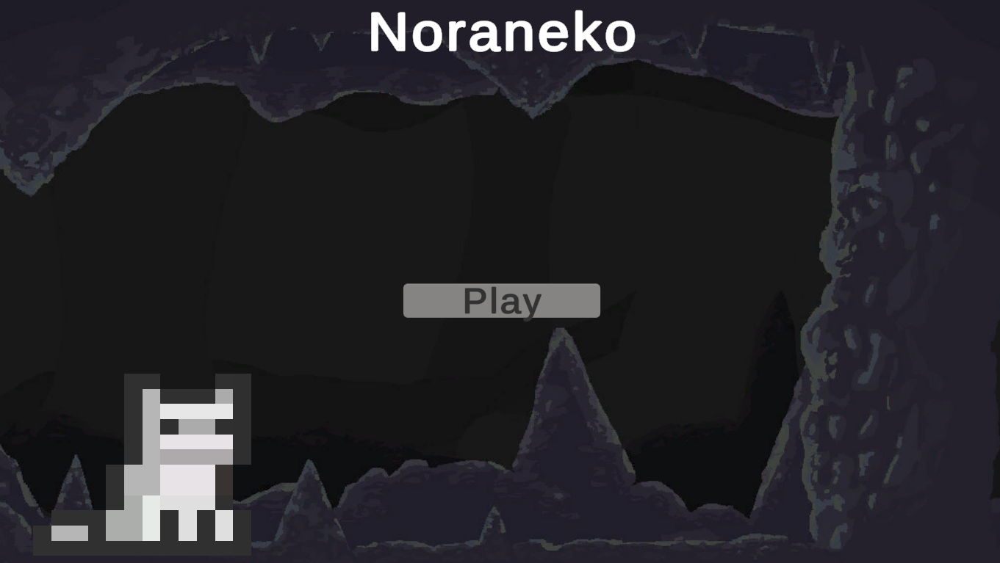
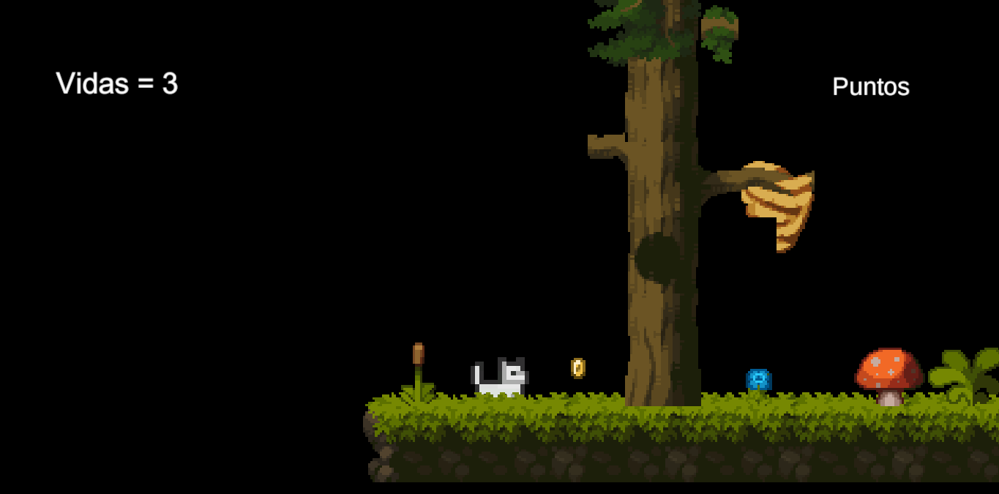
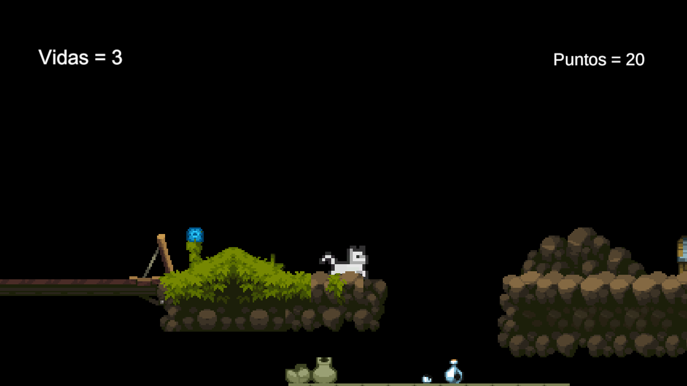
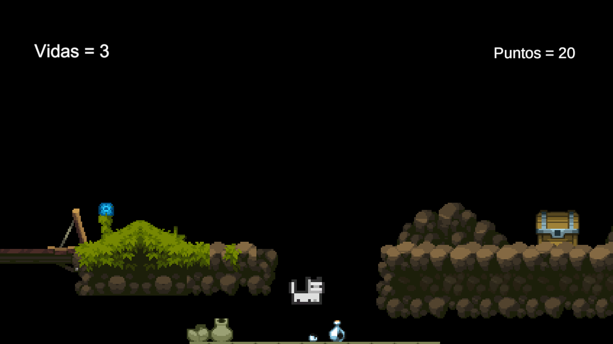
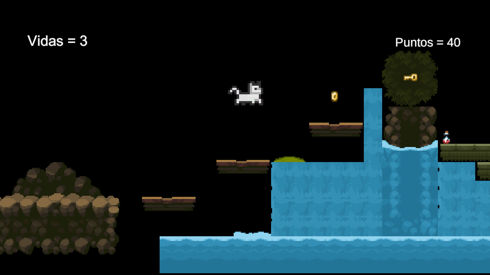

# Noraneko

<p align="center">
  
  
  
  
  
</p>

<p align="center">
  
</p>

<p align="center">
  A 2D pixel-art platformer developed in Unity, where the player controls a cat through forest and cave environments while collecting items, earning points, and navigating platforming challenges.
</p>

## Overview

**Noraneko** is a 2D game created with Unity. The experience begins from a custom start menu and places the player in handcrafted side-scrolling levels featuring elevated terrain, gaps, collectible items, interactive scenery, and a visible HUD for lives and score progression.

The project focuses on core 2D gameplay mechanics, including player movement, jumping, collectible-driven scoring, and level traversal in a pixel-art environment.

## Features

- 2D pixel-art platforming gameplay.
- Custom start menu and in-game HUD.
- Lives and point tracking.
- Collectibles distributed across the level.
- Forest, cave, waterfall, and elevated-platform scenes.
- Built with **Unity 2022.3.3f1**.

## Screenshots

<p align="center">
  
  
</p>

<p align="center">
  
  
</p>

## Run the Project

1. Install **Unity Hub** and Unity **2022.3.3f1**.
2. Clone this repository or download the source code.
3. In Unity Hub, select **Add** and choose this project folder.
4. Open the project with Unity **2022.3.3f1**.
5. Open the main scene and press the **Play** button in the Unity Editor.

## Project Structure

```text
Assets/             # Unity scenes, scripts, sprites, audio, and game resources
Packages/           # Package dependencies
ProjectSettings/    # Unity project configuration
docs/screenshots/   # Images used in this README
```

## Author

Developed by [Paulo Salazar](https://github.com/SalazarPaulo).
